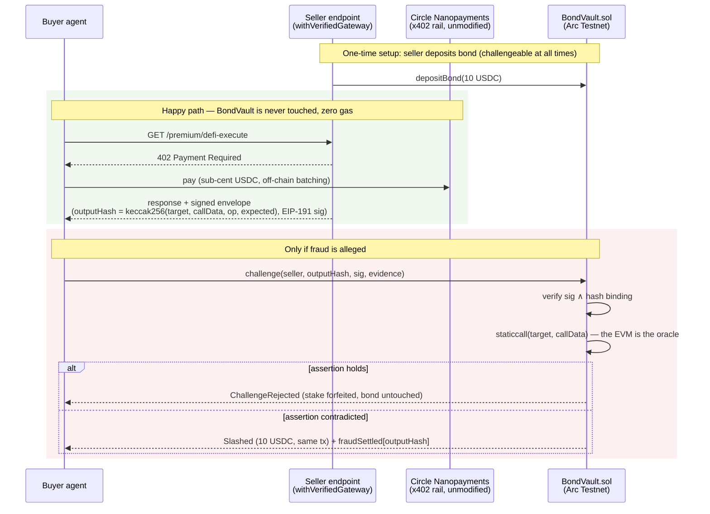

# Veriton — the honesty layer for x402

**Pay without praying.**

> **Demo video:** https://www.youtube.com/watch?v=pLceo6uEJO8

x402 lets agents pay each other per-request in USDC. But payment settles the moment the response arrives — before anyone knows whether the response is *true*. An agent that claims "I supplied your USDC to Aave" gets paid whether or not it did. Today's agentic economy runs on **pay-and-pray**.

Veriton adds the missing layer: sellers post a bond, sign their outputs, and get **slashed on-chain when a claim is provably fabricated**. No trusted oracle, no arbitration committee — only claims that anyone can re-verify deterministically.

## Who is this for

- **Buyer agents** paying for claims they cannot cheaply re-verify per request — "I executed your DeFi order", "this source says X". Veriton turns "trust the seller" into "trust the chain state".
- **Seller agents** who are actually honest and want that to be economically legible: a posted, challengeable bond is a signal no self-description can fake.
- **Builders of agent marketplaces** who need an accountability layer that composes with x402 instead of replacing it — BondVault is permissionless and the envelope format is self-contained, so no marketplace-side integration is required to start.

It is *not* for adjudicating quality, opinion, or honest error. Veriton draws that line on purpose (see below).

## Two layers, zero changes to the payment rail

| Layer | What | Frequency |
|---|---|---|
| **Payment** | Circle Nanopayments (x402 + Gateway batching), used **unmodified** | Every request, sub-cent |
| **Collateral** | `BondVault.sol` on Arc — bond, challenge, slash | Only when fraud is alleged |

The seller wraps its paid endpoint with `withVerifiedGateway` (a composition over Circle's `withGateway` — Circle code is vendored verbatim under Apache-2.0, untouched). Every paid response then carries a **signed, challengeable assertion**: the exact bytes that `BondVault._verifyOnchainClaim` will re-check via `staticcall` if anyone challenges.



The payment rail never learns about the bond; the bond contract never learns about the payment. The only coupling is the signed envelope the seller attaches to every paid response — and that coupling is one-directional and opt-in.

## What gets slashed — and what doesn't

Veriton slashes **deterministic fabrications only**:

1. Source-existence fraud (cited source does not exist)
2. Cited-value mismatch (quoted number differs from the source)
3. **On-chain execution fraud** (claimed a tx/state that the chain contradicts) ← live in v1

Quality, interpretation, and wrong-but-honest predictions are **never** slashed. That is the job of a reputation layer, not a penalty layer. Collapsing "lied" and "was wrong" into one score is how reputation systems get gamed; Veriton keeps them separate by construction.

## How general is the verification?

The primitive is deliberately narrow and deliberately generic: **any claim expressible as "`staticcall(target, callData)` returns a value in relation `op` to `expected`" is challengeable.** The demo asserts an aToken balance, but nothing in BondVault knows what Aave is — the same envelope format covers ERC-20 balances, oracle readings, registry entries, governance state, LP positions, or any view function on any contract.

The honest boundary of that generality:

- It covers **present on-chain state** (past-transaction claims need Merkle receipt proofs — roadmap ④).
- It covers **what the predicate says, not what it means** — pinning `target` to a canonical address is the buyer's job (see Known Limitations).
- Off-chain claims (ⓐ source-existence, ⓑ cited-value) ride the same challenge rail but resolve optimistically in v1.

One primitive, one trust assumption (the EVM itself), an open-ended claim surface. The roadmap grows the surface without ever adding a second trust assumption until item ⑤ — which is exactly why it is last.

## Why no trusted oracle

The assertion is bound before delivery:

```
outputHash == keccak256(abi.encode(target, callData, op, expected))
```

The seller signs `outputHash` (EIP-191). A challenger submits the seller's own signed bytes — nothing else is accepted (`evidence mismatch` otherwise), so honest sellers cannot be framed with crafted predicates. The contract re-runs `staticcall(target, callData)` itself and compares. Anyone can reproduce the verdict; nobody has to be trusted.

## Veriton as a protocol, not a platform

Nothing in Veriton requires Veriton's permission or infrastructure:

- **BondVault is permissionless.** Any seller can deposit a bond; any party can challenge. There is no allowlist, no operator role in the verdict path, no upgrade key over settled outcomes.
- **The envelope is self-contained.** `(target, callData, op, expected, outputHash, signature)` is everything a verifier needs. The `/verify` panel is a convenience, not a dependency — the same verdict is reproducible with `cast` or a raw `eth_call`, gas-free, by anyone.
- **The payment rail is untouched.** Sellers opt in by wrapping their endpoint; buyers opt in by checking envelopes. Neither side needs the other to have heard of Veriton for x402 itself to keep working.

If the hosted app disappeared tomorrow, every bond, every settled verdict, and every envelope already issued would remain verifiable. That is the test we hold ourselves to.

## Live evidence (Arc Testnet)

All three verdicts have been exercised on-chain against the deployed contract — using the **same byte-identical signed envelope** (same `outputHash`, same signature); only the chain state differed between runs:

| Case | What happened | Tx |
|---|---|---|
| **Honest → reject** | Seller signed "aToken balance ≥ 100 USDC", balance really was 100 USDC → `ChallengeRejected`, bond untouched, challenger stake forfeited | `0xd346182620770e5ce5256ea1a0141f0313674d69f492fb2b72307dcddbace083` |
| **Fraud → slash** | Balance dropped to 0, the very same envelope re-challenged → `Slashed` (10 USDC) in the same tx as the challenge | `0x88182e6afbcd9643a10542fa83f4ccf1e5f51a10ad6837bb5fba71e927d6cdeb` |
| **Replay → blocked** | A third challenge with the same envelope reverts `output already slashed` — one output, one slash (reproducible as a gas-free `eth_call` by anyone) | — |

The first two rows are the system's core claim made concrete: the verdict is a pure function of chain state, not of anyone's opinion.

Deployed addresses:

| Contract | Address |
|---|---|
| BondVault | `0xb1e5fd74a816d2f3Bee521D9c6aa42419D967b2D` |
| MockAToken (demo verification target) | `0x700610Ee6ca6Fd17Fa274B1966C7e0559157907e` |
| USDC (Arc Testnet native) | `0x3600000000000000000000000000000000000000` |

Explorer: https://testnet.arcscan.app/address/0xb1e5fd74a816d2f3Bee521D9c6aa42419D967b2D

## Slash economics

Penalty distribution is **60 / 20 / 20** — victim compensation / challenger reward / protocol. In v1 the victim and the challenger are assumed to be the same party (the buyer challenges on its own behalf), so `_slash` pays victim + challenger shares + stake refund to the challenger in one transfer; separating victim resolution is a v2 item and marked as such in the contract. False accusations cost the challenger their 1 USDC stake (forfeited to protocol on `_reject`).

The bond is a **deterrence stake, not an escrow** — the same design class as PoS validator slashing. Honest operation consumes zero bond regardless of volume: a seller serving a million truthful responses posts the same 10 USDC as one serving ten. What the bond bounds is not throughput but *lying capacity*:

```text
compensation capacity = bondOf(seller) / PENALTY          (in v1: bond / 10 USDC)
expected fraud value  < P(challenge) × PENALTY             (deterrence condition)
```

The first line is why buyers should read the seller's **free bond** (`bondOf − lockedOf`) before paying: a seller with a 10 USDC bond can make exactly one fabrication whole — and a seller whose free bond is *below* the penalty cannot be challenged at all (see Known Limitations). The second is why the fixed penalty is a real v1 limitation — when a single response is worth more than `P(challenge) × 10 USDC`, deterrence breaks, and no bond size fixes that without proportional stakes (structurally unavailable; see Known Limitations and roadmap ②).

A slashed seller is not exiled: `depositBond` is permissionless, so rebonding and re-entering is always possible. Slash history stays permanently readable from `Slashed` events regardless — collateral is spendable and refillable, history is neither. Keeping those two legible *separately* (rather than letting the bond balance double as an implicit reputation score) is deliberate, and the same separation Veriton draws between penalties and reputation.

Two properties make the bond an actual deterrent rather than a decoration:

- **Withdrawal is two-step.** `requestUnbond` → `UNBOND_DELAY` (1 h, demo-length) → `withdrawBond`. The bond stays challengeable for the full delay — `bondOf` is untouched until withdrawal — so "fabricate, then withdraw before anyone challenges" has a zero-length escape window: any challenge landing inside the delay locks the funds and a confirmed slash shrinks what can leave.
- **One output, one slash.** A slashed `outputHash` cannot be re-challenged (`fraudSettled`). Without this, a single fabricated output could be replayed to drain the entire bond — correct only under v1's victim == challenger assumption, and revisited when victims are separated in v2.

## What is real vs. staged — honest disclosure

- **Layer 1 — contracts and verification: real.** BondVault is deployed on Arc Testnet; every slash/reject above is an immutable on-chain transaction anyone can inspect or reproduce with `cast`.
- **Layer 2 — the demo economy: staged by the operator.** Seller, buyer, and challenger wallets are all operated by the author. Note the incentive direction: in the fraud demo **the operator slashes their own seller's bond** — the demo is adverse to its own operator.
- **Layer 3 — external participants: none yet.** No third party has posted a bond or filed a challenge. We state this rather than simulate traction.

## Known limitations (v1)

Stated here so nobody has to discover them the hard way:

- **Fixed penalty and fixed stake.** The slash penalty is a flat 10 USDC and the challenger stake a flat 1 USDC. Proportional stakes ("10% of the payment") are structurally impossible in this design, not merely unimplemented: payments ride the x402 rail entirely off-chain, so the contract never observes a payment amount. Scaling deterrence to economic weight is what the tiered-bond roadmap item is for.
- **A bond below the penalty is a decoration.** `challenge` locks the full penalty at open, so it reverts (`insufficient free bond`) whenever the seller's free bond (`bondOf − lockedOf`) is under 10 USDC. A seller bonded at 5 USDC therefore *looks* bonded but is economically unslashable — worse than unbonded, because it can lend false comfort. Buyers must treat free bond < penalty as unbonded (pinned by `test_SubPenaltyBond_IsUnchallengeable`). The flip side is a micro-seller entry floor: "start with a 1 USDC bond" is not meaningful in v1. Roadmap ②'s newcomer *exposure cap* is the intended answer — capping what newcomers can sell, rather than shrinking what they can lose, keeps deterrence intact where bootstrap fraud is most likely.
- **`OFFCHAIN` defence is optimistic-only.** For source-existence and cited-value claims, any non-empty counter-evidence flips the challenge to rejection at `resolve`. v1 records the counter-evidence hash as a fixed point for off-chain re-verification by watchers; it does not adjudicate. Escalation (UMA-style) is v2. The on-chain rail for these claim types exists and is tested — what v1 lacks is teeth, and we say so.
- **Current-state attestation can misfire.** `ONCHAIN` claims check present state. A seller who genuinely supplied and then withdrew would look fabricated. This is disclosed in the contract; Merkle receipt proofs over past transactions (a-1) are the v2 fix. It is accurate for the demo class — DeFi execution where the position is supposed to persist.
- **An unreadable target counts as fabrication.** If the asserted target reverts on `staticcall` or returns nothing, the verdict is fabricated — there is no separate `Unverifiable` outcome. The stance: the provider signed the assertion, target included; signing an unreadable target is the provider's failure. A third verdict (stake returned, bond untouched) is a v2 refinement.
- **Trustlessness proves the assertion holds, not that it means anything.** `staticcall` re-execution shows the *signed predicate* is true. It cannot show the predicate references the canonical contract — a seller could assert a balance on a look-alike token they deployed themselves. Buyers (or the buyer-side SDK, roadmap) must pin asserted targets to known addresses before paying.
- **Parallel `OFFCHAIN` challenges on one output can each lock and slash within the window.** This is `OFFCHAIN`-only: `ONCHAIN` verdicts settle in the same transaction as the challenge, so `fraudSettled` is already set before any second challenge can land — no window exists. Two mitigations already bound the damage: only sequential re-slash is guarded (`fraudSettled`), and each open challenge locks the full penalty, so at most `freeBond / penalty` challenges can be in flight simultaneously (pinned by `test_LockGate_SecondParallelChallengeReverts`) — draining N × 10 USDC requires the seller to have N × 10 USDC free and N challengers inside one window. Under victim == challenger this over-punishes a real fraudster rather than harming honest parties; still, it is a sharp edge. The v1.1 fix is a `fraudSettled` re-check at `resolve` (first settlement wins, later ones refund); per-request salts in the envelope are the complementary fix for the seller-side bug of handing one signed envelope to many buyers. Both are contract changes and deliberately deferred past the current deployment.
- **Challenge gas is a griefing surface.** Every challenge — including ones destined for rejection — forces the contract to execute a seller-chosen-target `staticcall`, and the 1 USDC stake bounds the *economic* cost of frivolous challenges but not the *gas* cost of processing them. A hostile challenger cannot take a seller's bond, but can force the protocol to burn gas at 1 USDC per attempt. On Arc's fee regime this is a nuisance, not an attack; on an expensive chain the stake would need to scale with gas price.

## Roadmap (v2)

Ordered by how much they extend coverage **without** giving up the EVM-as-oracle property:

1. **Conditional escrow lane.** Prediction-type claims ("state X will hold at deadline T") resolved by the same `staticcall` predicate at T — extends Veriton from facts to time-axis claims with zero new trust assumptions. Direct answer to the "deterministic claims are a narrow slice" critique.
2. **Tiered bond rates + newcomer exposure cap.** Bond requirements ease as `rejected-challenge` count grows; new sellers face a payment cap for their first N outputs. Structural answer to bootstrap fraud (deposit big, lie once, exit).
3. **Victim / challenger separation.** Bind the buyer to `outputHash` at purchase so third-party watchers can challenge while compensation still reaches the victim.
4. **Merkle receipt proofs (a-1).** Past-transaction claims without current-state footprint.
5. **zkTLS / TLS-notary for source-existence claims.** Extends ⓐⓑ beyond optimistic defence — deliberately last, because it is the first item that imports a trust assumption (the notary) into a system whose selling point is having none.

## Circle Product Feedback

Veriton is built directly on Circle's Arc Nanopayments stack, so this section is written from the position of an integrator, not a spectator.

**Why we chose it.** The x402 + Gateway batching model is the only payment primitive we found where per-request, sub-cent agent-to-agent payment is real rather than aspirational. Crucially for Veriton's thesis, the rail is *composable without modification*: `withVerifiedGateway` wraps `withGateway` as a pure function composition, and every Circle file is vendored verbatim under its Apache-2.0 header. A verification layer that required forking the payment rail would be a platform; because Circle's design let us avoid that, Veriton can be a protocol.

**What worked well.**
- The demo repo (`arc-nanopayments-demo`) is genuinely runnable — the 402 handshake, batching, and settlement all worked on Arc Testnet without undocumented steps.
- Arc's fast finality makes the challenge → verdict loop feel synchronous: `Slashed` lands in the same transaction as `challenge`, which is what makes the live demo legible.
- Native USDC as the gas-and-bond asset removes an entire class of demo friction (no faucet juggling across two tokens).

**Where we hit friction.**
- **The payment amount is invisible on-chain, by design — which caps what a collateral layer can promise.** Because x402 payments settle off-chain and batch through Gateway, no contract can observe how much a given response was paid. Proportional deterrence ("stake 10% of the payment") is therefore *structurally impossible*, not merely unimplemented — this is the direct cause of Veriton's fixed 10 USDC penalty (see Known Limitations) and the motivation for the tiered-bond roadmap item. It is the single most consequential constraint we inherited.
- The boundary between what `withGateway` guarantees and what the integrator must re-check (e.g. replay semantics of a settled payment header) had to be established by reading vendored source rather than reference docs.

**Suggestions.**
1. **An optional, privacy-preserving payment attestation.** Even a coarse one — a signed digest binding `(payer, payee, amountBucket, requestHash)` that a contract could verify — would unlock proportional stakes and per-payment escrow for every project building accountability on top of x402, without putting per-request amounts on-chain in the clear.
2. **A stable "integrator surface" doc for `withGateway`**: which invariants are guaranteed across versions, which are incidental. Composition-based extensions like ours depend on that contract being explicit.
3. **First-class Arc Testnet state manipulation for demos** (e.g. documented `setBalance`-style cheatcodes or a faucet API): adversarial demos need to *stage fraud* reproducibly, and today that requires custom mock contracts.

## Repository layout

```
onchain/   Foundry — BondVault.sol, tests (forge test)
app/       Next.js seller + agent (based on Circle's arc-nanopayments-demo)
  lib/verified-gateway.ts        Veriton wrapper (MIT) over Circle's withGateway (Apache-2.0)
  app/api/premium/defi-execute/  Veriton demo endpoint: paid DeFi execution + signed assertion
  gen-envelope.mts               canonical envelope generator (Node-only, no Next.js needed)
```

## Reproduce the honest-case flow

```bash
cd onchain && set -a; source .env; set +a
RPC=$ARC_TESTNET_RPC_URL

# seller posts bond
cast send $USDC_ADDR "approve(address,uint256)" $BONDVAULT_ADDR 10000000 --private-key $SELLER_PRIVATE_KEY --rpc-url $RPC
cast send $BONDVAULT_ADDR "depositBond(uint256)" 10000000 --private-key $SELLER_PRIVATE_KEY --rpc-url $RPC

# generate the signed envelope (assertion: aToken balance >= 100 USDC)
cd ../app && npx tsx gen-envelope.mts <sellerAddr> <aTokenAddr> 100

# challenge with the seller's own signed bytes (claimType 0 = ONCHAIN, verdict is immediate)
cast send $BONDVAULT_ADDR "challenge(address,bytes32,bytes,uint8,bytes)" \
  <sellerAddr> <outputHash> <signature> 0 <evidence> --private-key $PRIVATE_KEY --rpc-url $RPC
```

If the balance satisfies the assertion the tx emits `ChallengeRejected`; if not, `Slashed` — in the same transaction.

## License

MIT, except files vendored from Circle's arc-nanopayments-demo (notably `app/lib/x402.ts`), which retain their Apache-2.0 headers and are used unmodified.
